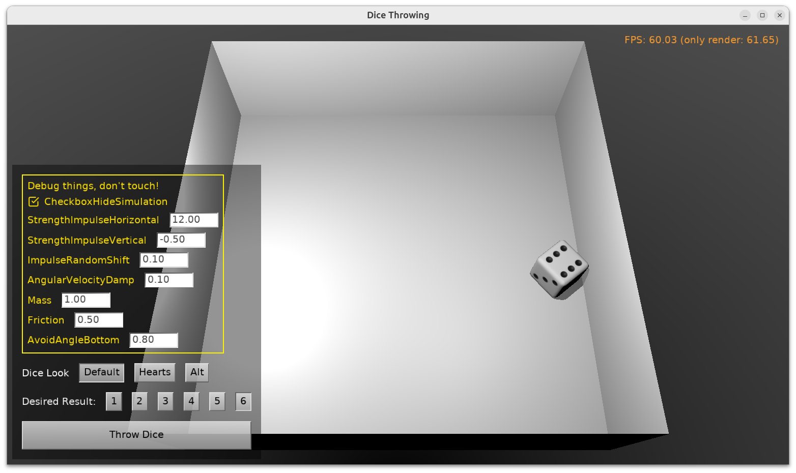

# Dice Throwing

Throw a 6-sided dice, using physics, watch how it rolls.

Despite using the physics simulation (so it looks nice and random), the result is predetermined from the start. (This is achieved by first running physics simulation invisibly and then rotating the actual displayed dice to match the known end rotation.)

Using [Castle Game Engine](https://castle-engine.io/).

Note that a _debug_ build (with `DEBUG` symbol) shows additional UI to tweak physics parameters.

## Play and Download

Play the web version without installation: https://castle-engine.io/web-demos/castle-dice-throwing/

Desktop versions (Windows, Linux): download release here: https://github.com/castle-engine/castle-dice-throwing/releases/latest

## Copyright and License

Copyright: _Michalis Kamburelis_.

License: BSD-3-Clause license, see [LICENSE](LICENSE) for details.

Except the dice 3D models, which are created by various artists (see [data/AUTHORS.md](data/AUTHORS.md)) and are licensed under _CC Attribution_.

## Building

Compile by:

- [CGE editor](https://castle-engine.io/editor). Just use menu items _"Compile"_ or _"Compile And Run"_.

- Or use [CGE command-line build tool](https://castle-engine.io/build_tool). Run `castle-engine compile` in this directory.

- Or use [Lazarus](https://www.lazarus-ide.org/). Open in Lazarus `castle_dice_throwing_standalone.lpi` file and compile / run from Lazarus. Make sure to first register [CGE Lazarus packages](https://castle-engine.io/lazarus).

- Or use [Delphi](https://www.embarcadero.com/products/Delphi). Open in Delphi `castle_dice_throwing_standalone.dproj` file and compile / run from Delphi. See [CGE and Delphi](https://castle-engine.io/delphi) documentation for details.